# IBM API Connect - 2DC HA/DR on CP4I - Proof Of Technology

This contains steps to install & configure two-data-center ha/dr active/passive configuration with API Connect running on Cloud Pak for Integration. This is just a Proof Of Technology. <br>

This PoC uses two IBM Techzone OpenShift vanilla clusters and a Linux VM serve as an HAProxy. <br>

IBM API Connect 2dcdr pattern replicates the Management, and Portal subsystems.<br>

Topology<br>

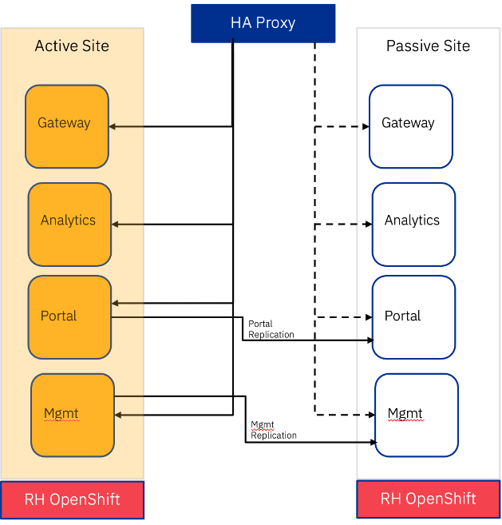
<br>
Reference: https://github.com/gowdhamanj/apic-multi-site-HA?tab=readme-ov-file


## 1. Initial setup 
Clone this repository.
<br>
Update global.properties, and set DC1, DC2 ingress domain values.<br>

```
ACTIVE_INGRESS_DOMAIN=apps.xxxx.cloud.techzone.ibm.com
ACTIVE_OPENSHIFT_API_URL=https://api.xxxx.cloud.techzone.ibm.com:6443
ACTIVE_OPENSHIFT_KUBEADMIN_PASSWORD=xxxx-xxxx-xxxx-xxxx

PASSIVE_INGRESS_DOMAIN=apps.yyyy.cloud.techzone.ibm.com
PASSIVE_OPENSHIFT_API_URL=https://api.yyyy.cloud.techzone.ibm.com:6443
PASSIVE_OPENSHIFT_KUBEADMIN_PASSWORD=yyyy-yyyy-yyyy-yyyy

CP4I_NAMESPACE=cp4i
APIC_INSTANCE_NAME=apim-demo
APIC_NAMESPACE=cp4i-apic
```


## 2. haproxy configuration

Install haproxy in a Linux VM.<br>
```
yum install haproxy
sudo systemctl enable haproxy
```

Update /etc/haproxy/haproxy.cfg file.<br>
```
frontend apic-https
 bind *:443
 mode tcp
 option tcplog
 use_backend apic-https

 backend apic-https
 mode tcp
 balance roundrobin
 option ssl-hello-chk

 #INFO: Ensure you comment the Passive Site
 server apps.xxxx.cloud.techzone.ibm.com xx.xx.xx.xx:443 check
 #server apps.xxxx.cloud.techzone.ibm.com yy.yy.yy.yy:443 check
 ```

Update /etc/hosts file as below.<br>
```
apps.xxxx.cloud.techzone.ibm.com xx.xx.xx.xx:443
apps.yyyy.cloud.techzone.ibm.com yy.yy.yy.yy:443
```


## 2. DC1 - Initial setup 

Install OpenShift Operator Catalog Sources, and Subscriptions. <br>

Run the commands in the below order. The setup script will,<br> a) Add Catalog sources for install cert-manager-redhat, Foundational Services, Cloud Pak for Integration Platform Navigator, DataPower, and API Connect<br>
b) Creates namespaces for Cloud Pak for integration, and API Connect<br>
c) Creates Operator Subscriptions<br>
d) Creates ibm-entitlement-key secret in api connect namespace<br>
e) Creates Platform Navigator instance \"cp4i-navigator\"<br>

Scripts:
```
export IBM_ENTITLEMENT_KEY=<your_cloudpak_entitlement-key>
dc1-0-login.sh
storage_default.sh
0-apic-operators-setup.sh 
```

## 2. DC1 - Create API Connect instance

Create certificates required, plus the APIC Instance.

```
Run the scripts,
By default, it will create the certificates, and APIC instance in cp4i-apic namespace.

dc1-1-create-certs.sh
dc1-2-create-apic-instance.sh
```

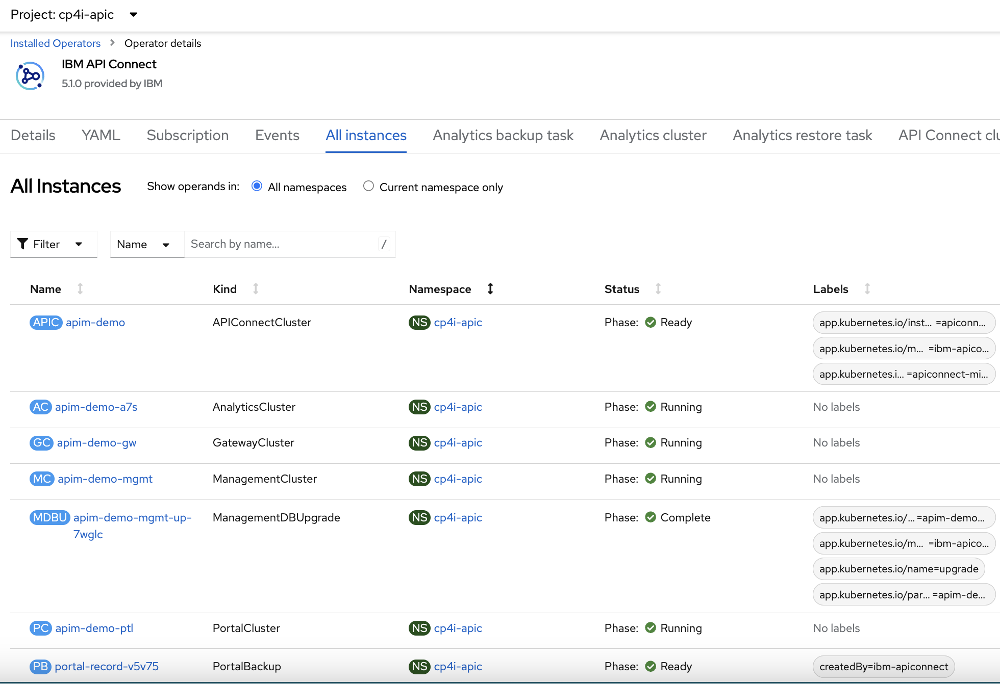

Verify the status of the instance. <br>
```
hastatus.sh

  {
    "lastTransitionTime": "2024-01-15T18:32:04Z",
    "message": "Cannot communicate with replication peer FQDN https://mgmt-replication.apps.65a575edb7693200118233e3.cloud.techzone.ibm.com/",
    "reason": "na",
    "status": "True",
    "type": "PeerNotReachable"
  },
  {
    "lastTransitionTime": "2024-01-15T18:31:23Z",
    "message": "",
    "reason": "na",
    "status": "False",
    "type": "BlockedWarmStandbyConversion"
  }
```
<br>


## 3. DC1 - Cloud Pak for Integration Platform Navigator
From the OpenShift Console, locate Platform Navigator URL as below.<br>
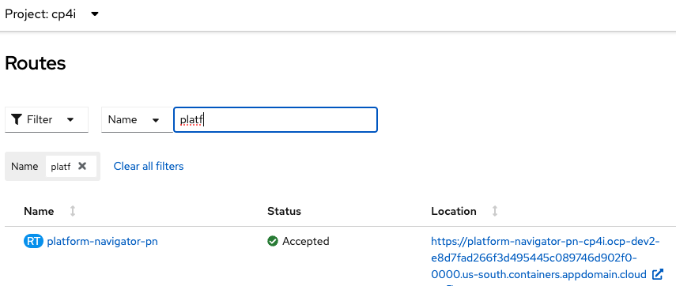

Extract the temporary integration-admin password.
```
oc get secret integration-admin-initial-temporary-credentials -n ibm-common-services -o jsonpath='{.data.password}' | base64 -d
```
Logon to CP4I as integration-admin using the temporary password.
<br>
Create a 15 character new password.<br>

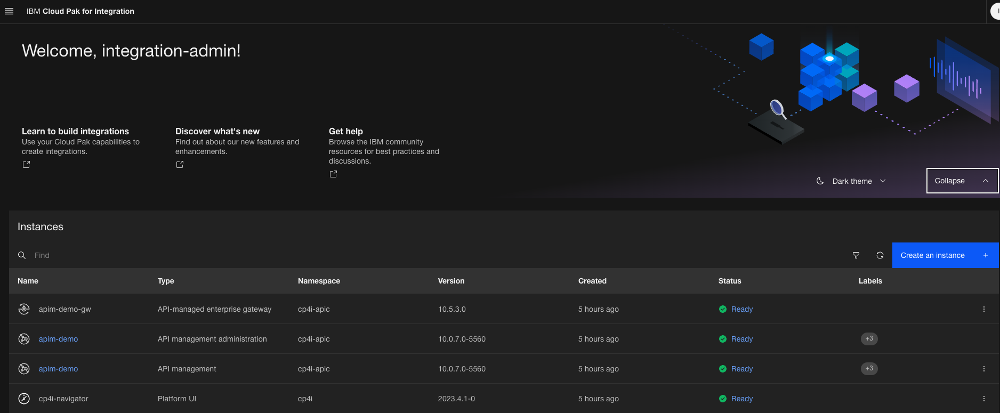

### 3.1 Update integration-admin user

Add email to integration-admin user.<br>

Navigate to Access control by clicking Navigation Menu in the top left corner. <br>
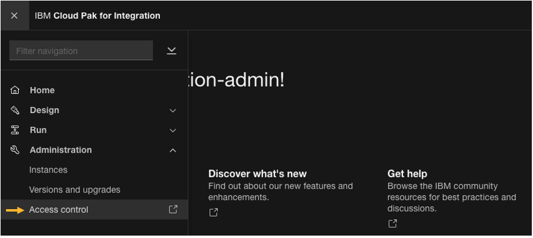

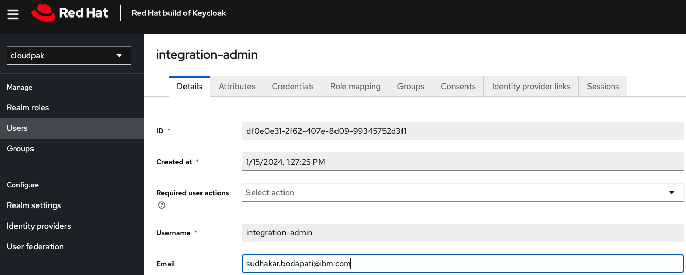

Save, and signout. <br>
<br>
<br>


## 4. DC1 - Cloud Manager Configuration
From the OpenShift Console, locate Platform Navigator URL under project cp4i > Routes.<br>


### 4.1 Email Notification

From the Cloud Pak for Integration Platform Navigator, open \"apim-demo\" API management administration.<br>

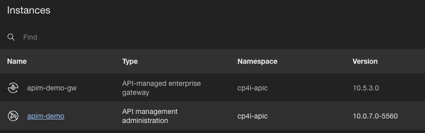

Use the \"Cloud Pak User Registry\" and login as integration-admin. <br>

Navigate Resources --> Notifications > \"Dummy mail server\" and configure your email server. in this case, i am using my mailtrap free account.<br>
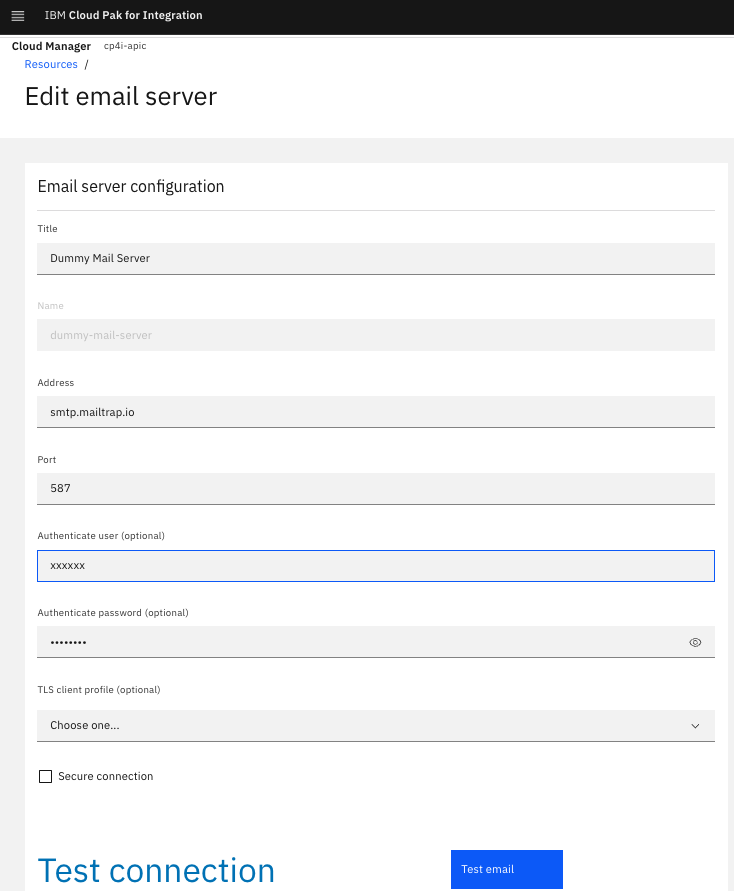


### 4.2 Create Provider Organization

Navigate to \"Manage Organizations\", and create an organization. <br>
<br>
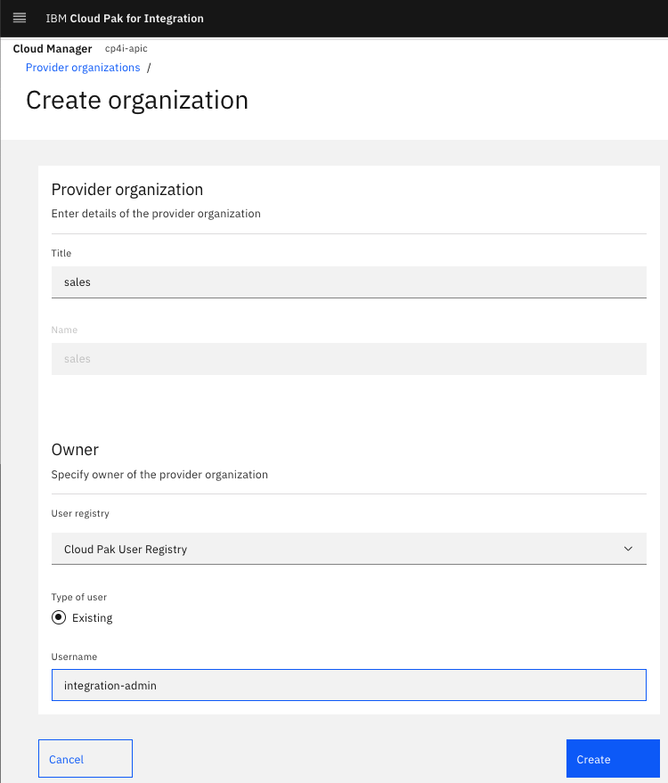


## 5. DC1 - API Manager Configuration
From the Cloud Pak for Integration Platform Navigator, open \"apim-demo\" API management.<br>

Use the \"Cloud Pak User Registry\" integration-admin if not logged in already. <br>
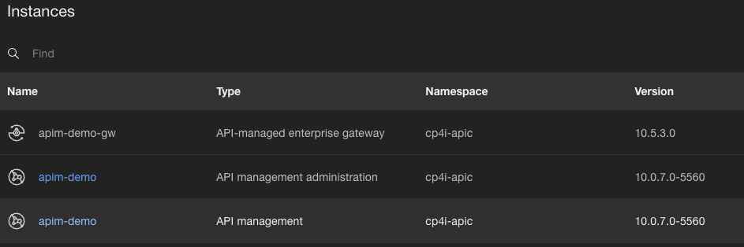


### 5.1 Create Portal
Navigate, Home --> Manage Catalog --> SandBox --> Catalog Settings --> Portal. <br>
Add Portal.<br>
Wait for 15 minutes, and you should get an email when the Portal is created. <br>
<br>
Meanwhile, do the below steps.<br>

### 5.2 Add API
Navigate to Home --> Develop APIs and Products --> Add --> Add API.<br>
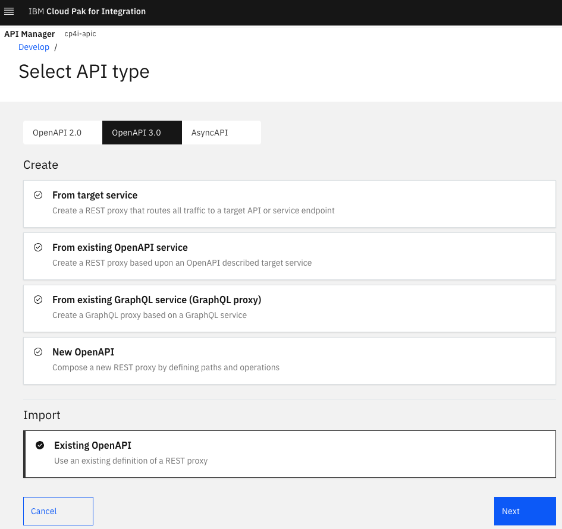

Add petstore-api_1.0.15.yaml.<br>


### 5.3 Add Product, Publish Product

Similarly, add petstore-product_1.0.0.yaml.
<br>

Publish the product.<br>
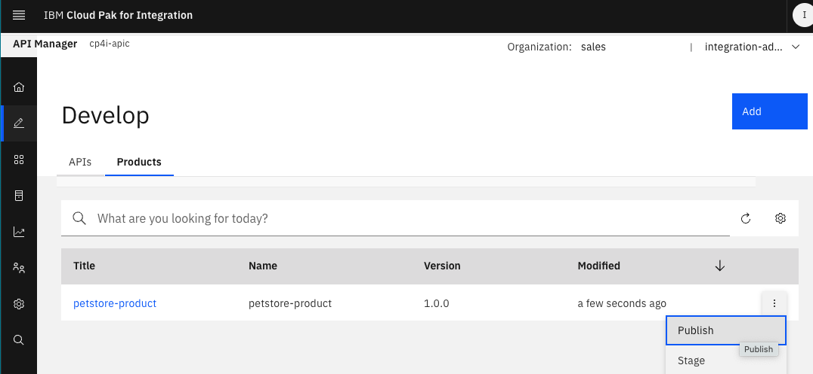
<br>
<br>


### 5.4 API Manager Portal 
Check your email, and make sure you received portal creation confirmation email. Click on the link and create a password for the \"admin\" account.<br>
<br>
<br>


## 6. DC2 - Initial setup 

Install OpenShift Operator Catalog Sources, and Subscriptions. <br>

Run the commands in the below order. The setup script will,<br>
a) Add Catalog sources for install cert-manager-redhat, Foundational Services, Cloud Pak for Integration Platform Navigator, DataPower, and API Connect<br>
b) Creates namespaces for Cloud Pak for integration, and API Connect<br>
c) Creates Operator Subscriptions<br>
d) Creates ibm-entitlement-key secret in api connect namespace<br>
e) Creates Platform Navigator instance \"cp4i-navigator\"<br>

Scripts:
```
export IBM_ENTITLEMENT_KEY=<your_cloudpak_entitlement-key>
dc2-0-login.sh
storage_default.sh
0-apic-operators-setup.sh 
```
<br>


## 7. DC2 - Create API Connect instance
Create certificates required, plus the APIC Instance.

```
Run the scripts,
By default, it will create the certificates, and APIC instance in cp4i-apic namespace.

dc2-1-create-certs.sh
dc2-2-create-apic-instance.sh
```


Verify the status of the instance. <br>
```
Output:
  {
    "lastTransitionTime": "2024-01-16T02:41:13Z",
    "message": "Warm Standby DB is ready",
    "reason": "na",
    "status": "True",
    "type": "Ready"
  },
  {
    "lastTransitionTime": "2024-01-16T02:41:09Z",
    "message": "",
    "reason": "na",
    "status": "False",
    "type": "Pending"
  },
```


## 8. DC2 - Cloud Pak for Integration Platform Navigator
From the OpenShift Console, locate Platform Navigator URL as below.<br>


Extract the temporary integration-admin password.
```
oc get secret integration-admin-initial-temporary-credentials -n ibm-common-services -o jsonpath='{.data.password}' | base64 -d
```
Logon to CP4I as integration-admin using the temporary password.
<br>
Create a 15 character new password.<br>


### 3.1 Update integration-admin user

Add email to integration-admin user.<br>

Navigate to Access control by clicking Navigation Menu in the top left corner. <br>


Save, and signout. <br>
<br>
<br>


## 9. DC1 - Failover to DC2

### 9.1 DC1 - Suspend Management Subsystem

```
dc1-3-suspend-mgmt.sh
```

```
hastatus.sh

haMode: BlockedWarmStandbyConversion
  {
    "lastTransitionTime": "2024-01-16T04:35:46Z",
    "message": "Progressing to WarmStandby: Backend ms and DB is in shutdown mode. Remote is https://mgmt-replication.apps.65a575edb7693200118233e3.cloud.techzone.ibm.com/. Remote HAMode is ReadyForPromotion. Expected it to be in either active or setup complete phase. If remote is in ReadyForPromotion. phase, continue with remote promotion",
    "reason": "na",
    "status": "True",
    "type": "BlockedWarmStandbyConversion"
  }
```


on DC2, you should see the management, and api connect cluster in Pending State.<br>

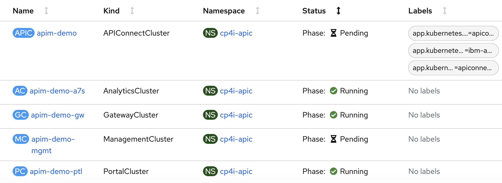

Also, see new management pods getting created.<br>
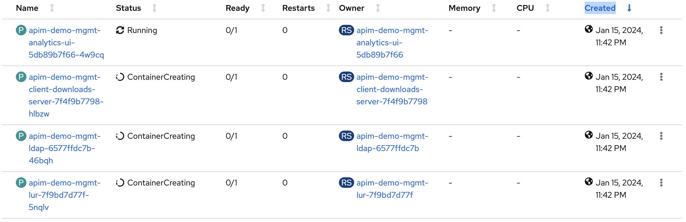

Pretty soon, the management, and api connect cluster should be in Ready state.<br>
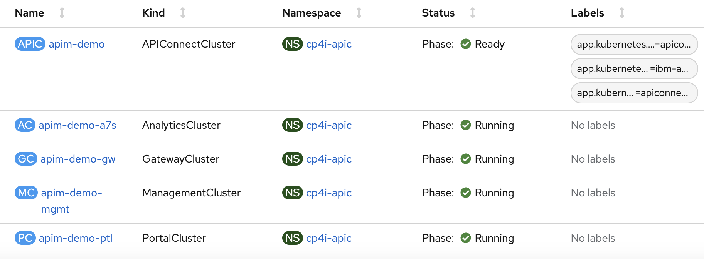


### 9.2 DC1 - Suspend Portal Subsystem

```
dc1-4-suspend-ptl.sh
```
On DC2, you should see <br>


Eventually, <br>
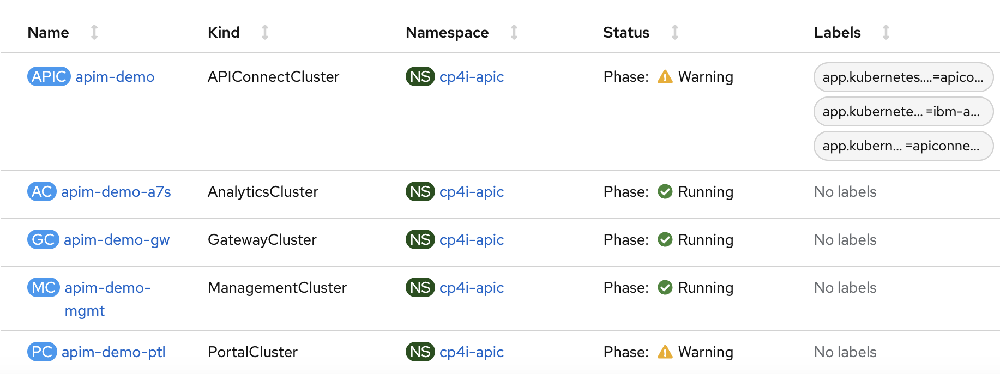

On DC2, <br>
APIC connect cluster and portal instances will be in Pending, and will becreating new pods.<br>
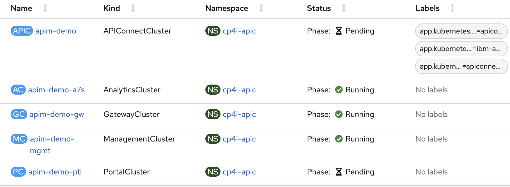

Eventually, the instances should be in Ready state.<br>


```
hastatus.sh
    haMode: active
.........
[
  {
    "lastTransitionTime": "2024-01-16T04:42:04Z",
    "message": "",
    "reason": "na",
    "status": "False",
    "type": "Warning"
  },
  {
    "lastTransitionTime": "2024-01-16T04:43:11Z",
    "message": "Active DB is ready",
    "reason": "na",
    "status": "True",
    "type": "Ready"
  }
  ```


## 10. Update haproxy.cfg 

sudo vi /etc/haproxy/haproxy.cfg <br>
Comment DC1 and uncomment DC2 configuration.<br>
```
 #server apps.xxxx.cloud.techzone.ibm.com xx.xx.xx.xx:443 check
server apps.yyyy.cloud.techzone.ibm.com yy.yy.yy.yy:443 check
 ```
Restart haproxy.<br>
```
sudo systemctl restart haproxy
```
<br>

## 11. DC2 - Verifification

Logon to Cloud Pak for Integration Console, and open apim-demo Cloud manager, and apim-demo API Manager. Make sure you can access both URL's. Make sure the petstore api and product are replicated.
<br><br>


## 12. Failback to DC1

### 12.1 DC2 - Suspend Management Subsystem

```
dc2-5-suspend-mgmt.sh
```

```
 hastatus.sh
    haMode: BlockedWarmStandbyConversion

     {
    "lastTransitionTime": "2024-01-16T05:04:43Z",
    "message": "Progressing to WarmStandby: Backend ms and DB is in shutdown mode. Remote is https://mgmt-replication.apps.65a555e6b7693200118233da.cloud.techzone.ibm.com/. Remote HAMode is ReadyForPromotion. Expected it to be in either active or setup complete phase. If remote is in ReadyForPromotion. phase, continue with remote promotion",
    "reason": "na",
    "status": "True",
    "type": "BlockedWarmStandbyConversion"
  }
```
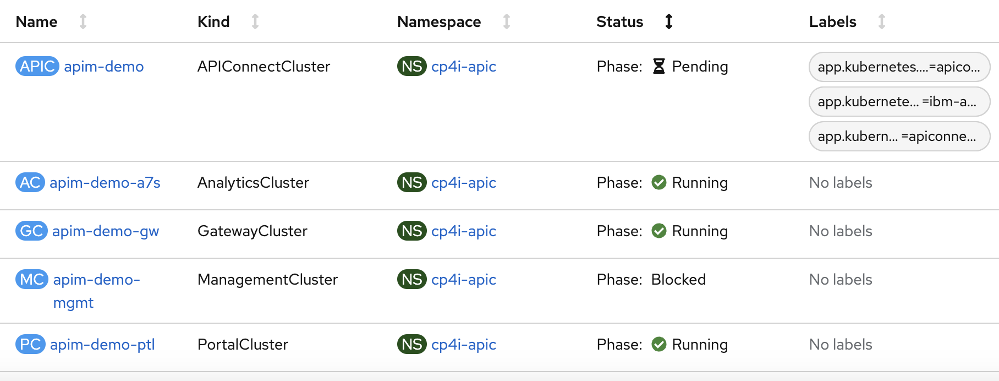

on DC1, eventually, all the subsytems should be in Ready/Running state in DC1.<br>
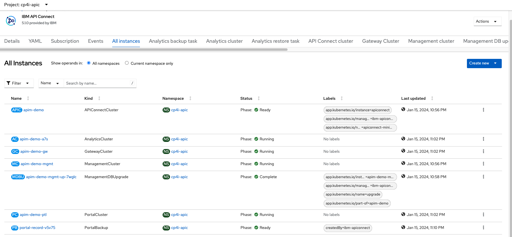

<br>

Wait 5 minutes and then suspend Portal on DC2. <br><br>


### 12.2 DC2 - Suspend Portal Subsystem

```
dc2-5-suspend-ptl.sh
```
<br>


## 13. DC1 - Verifification

Logon to Cloud Pak for Integration Console, and open apim-demo Cloud manager, and apim-demo API Manager. Make sure you can access both URL's. Make sure the petstore api and product are replicated.
<br>


!!! CONGRATULATIONS !!!